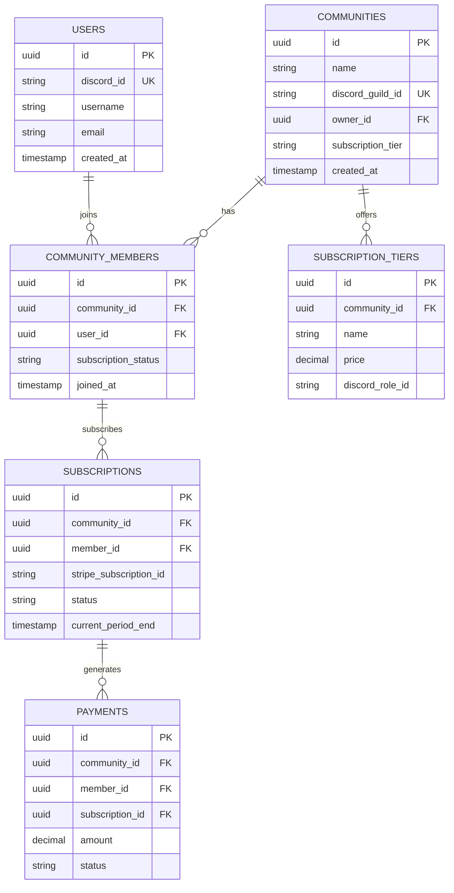

# Database Schema

CommunityOS uses PostgreSQL as the primary database with a multi-tenant architecture.

## 🏢 Database Architecture

### Multi-Tenant Strategy
- **Row-Level Security (RLS)**: Each community is isolated by `community_id`
- **Shared Database**: All tenants share the same database instance
- **Tenant Isolation**: Complete data isolation between communities

## 📋 Core Tables

### Communities
```sql
CREATE TABLE communities (
    id UUID PRIMARY KEY DEFAULT gen_random_uuid(),
    name VARCHAR(255) NOT NULL,
    slug VARCHAR(100) UNIQUE NOT NULL,
    discord_guild_id VARCHAR(20) UNIQUE NOT NULL,
    owner_id UUID NOT NULL REFERENCES users(id),
    description TEXT,
    avatar_url TEXT,
    subscription_tier VARCHAR(50) NOT NULL DEFAULT 'free',
    status VARCHAR(20) NOT NULL DEFAULT 'active',
    settings JSONB DEFAULT '{}',
    created_at TIMESTAMP WITH TIME ZONE DEFAULT NOW(),
    updated_at TIMESTAMP WITH TIME ZONE DEFAULT NOW()
);
```

### Users
```sql
CREATE TABLE users (
    id UUID PRIMARY KEY DEFAULT gen_random_uuid(),
    discord_id VARCHAR(20) UNIQUE NOT NULL,
    username VARCHAR(100) NOT NULL,
    discriminator VARCHAR(10),
    email VARCHAR(255),
    avatar_url TEXT,
    global_name VARCHAR(100),
    locale VARCHAR(10) DEFAULT 'en-US',
    premium_type INTEGER DEFAULT 0,
    is_admin BOOLEAN DEFAULT FALSE,
    last_login TIMESTAMP WITH TIME ZONE,
    created_at TIMESTAMP WITH TIME ZONE DEFAULT NOW(),
    updated_at TIMESTAMP WITH TIME ZONE DEFAULT NOW()
);
```

### Community Members
```sql
CREATE TABLE community_members (
    id UUID PRIMARY KEY DEFAULT gen_random_uuid(),
    community_id UUID NOT NULL REFERENCES communities(id) ON DELETE CASCADE,
    user_id UUID NOT NULL REFERENCES users(id) ON DELETE CASCADE,
    discord_user_id VARCHAR(20) NOT NULL,
    nickname VARCHAR(100),
    roles TEXT[] DEFAULT '{}',
    joined_at TIMESTAMP WITH TIME ZONE DEFAULT NOW(),
    subscription_status VARCHAR(20) DEFAULT 'none',
    subscription_tier VARCHAR(50),
    subscription_expires_at TIMESTAMP WITH TIME ZONE,
    total_spent DECIMAL(10,2) DEFAULT 0.00,
    is_active BOOLEAN DEFAULT TRUE,
    created_at TIMESTAMP WITH TIME ZONE DEFAULT NOW(),
    updated_at TIMESTAMP WITH TIME ZONE DEFAULT NOW(),
    UNIQUE(community_id, user_id)
);
```

### Subscriptions
```sql
CREATE TABLE subscriptions (
    id UUID PRIMARY KEY DEFAULT gen_random_uuid(),
    community_id UUID NOT NULL REFERENCES communities(id) ON DELETE CASCADE,
    member_id UUID NOT NULL REFERENCES community_members(id) ON DELETE CASCADE,
    stripe_subscription_id VARCHAR(100) UNIQUE,
    stripe_customer_id VARCHAR(100) NOT NULL,
    tier_name VARCHAR(100) NOT NULL,
    status VARCHAR(20) NOT NULL,
    current_period_start TIMESTAMP WITH TIME ZONE NOT NULL,
    current_period_end TIMESTAMP WITH TIME ZONE NOT NULL,
    cancel_at_period_end BOOLEAN DEFAULT FALSE,
    canceled_at TIMESTAMP WITH TIME ZONE,
    trial_start TIMESTAMP WITH TIME ZONE,
    trial_end TIMESTAMP WITH TIME ZONE,
    metadata JSONB DEFAULT '{}',
    created_at TIMESTAMP WITH TIME ZONE DEFAULT NOW(),
    updated_at TIMESTAMP WITH TIME ZONE DEFAULT NOW()
);
```

### Subscription Tiers
```sql
CREATE TABLE subscription_tiers (
    id UUID PRIMARY KEY DEFAULT gen_random_uuid(),
    community_id UUID NOT NULL REFERENCES communities(id) ON DELETE CASCADE,
    name VARCHAR(100) NOT NULL,
    description TEXT,
    price DECIMAL(10,2) NOT NULL,
    currency VARCHAR(3) DEFAULT 'USD',
    interval VARCHAR(20) NOT NULL, -- monthly, yearly
    stripe_price_id VARCHAR(100) UNIQUE,
    features JSONB DEFAULT '[]',
    discord_role_id VARCHAR(20),
    max_members INTEGER,
    is_active BOOLEAN DEFAULT TRUE,
    sort_order INTEGER DEFAULT 0,
    created_at TIMESTAMP WITH TIME ZONE DEFAULT NOW(),
    updated_at TIMESTAMP WITH TIME ZONE DEFAULT NOW(),
    UNIQUE(community_id, name)
);
```

### Payments
```sql
CREATE TABLE payments (
    id UUID PRIMARY KEY DEFAULT gen_random_uuid(),
    community_id UUID NOT NULL REFERENCES communities(id),
    member_id UUID NOT NULL REFERENCES community_members(id),
    subscription_id UUID REFERENCES subscriptions(id),
    stripe_payment_intent_id VARCHAR(100) UNIQUE,
    stripe_charge_id VARCHAR(100),
    amount DECIMAL(10,2) NOT NULL,
    currency VARCHAR(3) NOT NULL,
    status VARCHAR(20) NOT NULL,
    description TEXT,
    metadata JSONB DEFAULT '{}',
    processed_at TIMESTAMP WITH TIME ZONE,
    created_at TIMESTAMP WITH TIME ZONE DEFAULT NOW(),
    updated_at TIMESTAMP WITH TIME ZONE DEFAULT NOW()
);
```

### Discord Bot Configurations
```sql
CREATE TABLE discord_bot_configs (
    id UUID PRIMARY KEY DEFAULT gen_random_uuid(),
    community_id UUID NOT NULL REFERENCES communities(id) ON DELETE CASCADE,
    bot_token_encrypted TEXT NOT NULL,
    client_id VARCHAR(20) NOT NULL,
    permissions BIGINT NOT NULL,
    prefix VARCHAR(10) DEFAULT '!',
    welcome_message TEXT,
    farewell_message TEXT,
    auto_role_assignment BOOLEAN DEFAULT TRUE,
    payment_verification_channel VARCHAR(20),
    admin_channel VARCHAR(20),
    settings JSONB DEFAULT '{}',
    is_active BOOLEAN DEFAULT TRUE,
    last_online TIMESTAMP WITH TIME ZONE,
    created_at TIMESTAMP WITH TIME ZONE DEFAULT NOW(),
    updated_at TIMESTAMP WITH TIME ZONE DEFAULT NOW(),
    UNIQUE(community_id)
);
```

### Analytics Events
```sql
CREATE TABLE analytics_events (
    id UUID PRIMARY KEY DEFAULT gen_random_uuid(),
    community_id UUID NOT NULL REFERENCES communities(id),
    event_type VARCHAR(50) NOT NULL,
    event_name VARCHAR(100) NOT NULL,
    user_id UUID REFERENCES users(id),
    discord_user_id VARCHAR(20),
    properties JSONB DEFAULT '{}',
    timestamp TIMESTAMP WITH TIME ZONE DEFAULT NOW(),
    session_id VARCHAR(100),
    ip_address INET,
    user_agent TEXT,
    created_at TIMESTAMP WITH TIME ZONE DEFAULT NOW()
);
```

## 🔗 Relationships



## 🔒 Security & Privacy

### Row Level Security (RLS)
```sql
-- Enable RLS on community-specific tables
ALTER TABLE community_members ENABLE ROW LEVEL SECURITY;
ALTER TABLE subscriptions ENABLE ROW LEVEL SECURITY;
ALTER TABLE subscription_tiers ENABLE ROW LEVEL SECURITY;
ALTER TABLE payments ENABLE ROW LEVEL SECURITY;

-- Policy for community isolation
CREATE POLICY community_isolation ON community_members
    FOR ALL TO app_user
    USING (community_id = current_setting('app.current_community_id')::uuid);
```

### Data Encryption
- **At Rest**: PostgreSQL TDE (Transparent Data Encryption)
- **In Transit**: TLS 1.3 for all connections
- **Sensitive Fields**: Application-level encryption for bot tokens

### GDPR Compliance
```sql
-- Data retention policies
CREATE TABLE data_retention_policies (
    id UUID PRIMARY KEY DEFAULT gen_random_uuid(),
    table_name VARCHAR(100) NOT NULL,
    retention_days INTEGER NOT NULL,
    deletion_criteria JSONB,
    last_cleanup TIMESTAMP WITH TIME ZONE
);
```

## 📈 Performance Optimization

### Indexes
```sql
-- Community lookups
CREATE INDEX idx_communities_discord_guild_id ON communities(discord_guild_id);
CREATE INDEX idx_communities_owner_id ON communities(owner_id);

-- Member queries
CREATE INDEX idx_community_members_community_id ON community_members(community_id);
CREATE INDEX idx_community_members_user_id ON community_members(user_id);
CREATE INDEX idx_community_members_discord_user_id ON community_members(discord_user_id);

-- Subscription queries
CREATE INDEX idx_subscriptions_stripe_subscription_id ON subscriptions(stripe_subscription_id);
CREATE INDEX idx_subscriptions_status ON subscriptions(status);
CREATE INDEX idx_subscriptions_current_period_end ON subscriptions(current_period_end);

-- Payment queries
CREATE INDEX idx_payments_community_id_created_at ON payments(community_id, created_at DESC);
CREATE INDEX idx_payments_stripe_payment_intent_id ON payments(stripe_payment_intent_id);

-- Analytics queries
CREATE INDEX idx_analytics_events_community_id_timestamp ON analytics_events(community_id, timestamp DESC);
CREATE INDEX idx_analytics_events_event_type ON analytics_events(event_type);
```

### Partitioning
```sql
-- Partition analytics_events by month
CREATE TABLE analytics_events_y2025m01 PARTITION OF analytics_events
    FOR VALUES FROM ('2025-01-01') TO ('2025-02-01');
```

## 🔄 Migrations

Migrations are managed using Prisma and stored in `/backend/prisma/migrations/`.

### Migration Commands
```bash
# Create new migration
npx prisma migrate dev --name add_new_feature

# Deploy to production
npx prisma migrate deploy

# Reset database (development only)
npx prisma migrate reset
```

## 📋 Backup Strategy

### Automated Backups
- **Frequency**: Every 6 hours
- **Retention**: 30 days for daily, 12 months for weekly
- **Storage**: AWS S3 with cross-region replication

### Point-in-Time Recovery
- **WAL Archiving**: Continuous archiving enabled
- **Recovery Window**: 7 days
- **RTO**: < 1 hour
- **RPO**: < 5 minutes